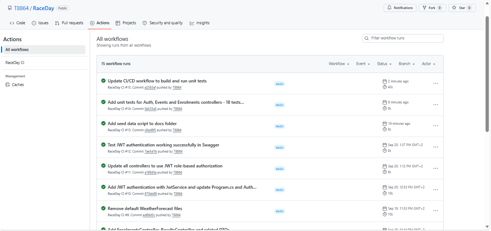

# RaceDay - Race Event Management System

## System Description
RaceDay is a web-based race event management system built with ASP.NET Core Web API. It allows Organisers to create and manage race events and Participants to browse and enrol in those events. The system uses JWT authentication and role-based authorization to control access.

## Roles

### Organiser
- Register and log in to the system
- Create, update and delete race events
- Manage race categories
- View all enrolments for events
- Capture and update race results for participants

### Participant
- Register and log in to the system
- Browse all upcoming race events
- Enrol in events under a specific category
- View their own enrolments
- View their personal race results

## Project Structure
/docs

RaceDay_Complete.sql (Part 1 SQL script)
RaceDay_SeedData.sql (Seed data script)
RaceDay_API_Endpoints.txt (API endpoint plan)
RaceDay_ERD.png (Entity Relationship Diagram)
ci-screenshot.png (CI/CD green build screenshot)

/RaceDay.API

Controllers/ (API controllers)
Models/ (Entity models)
DTOs/ (Data transfer objects)
Data/ (Database context)
Services/ (JWT service)

/RaceDay.Tests

Unit tests for Auth, Events and Enrolments

## Setup Instructions
1. Clone the repository
2. Open RaceDay.API.sln in Visual Studio
3. Update the connection string in appsettings.json to match your SQL Server instance
4. Run database migrations: Update-Database in Package Manager Console
5. Run the project and open Swagger at https://localhost:7174/swagger

## Authentication
The API uses JWT Bearer authentication. To access protected endpoints:
1. Register a user via POST /api/Auth/register
2. Login via POST /api/Auth/login to get a JWT token
3. Click Authorize in Swagger and paste the token
4. All protected endpoints will now be accessible based on your role

## CI/CD

## Video Presentation
[RaceDay System Walkthrough]()